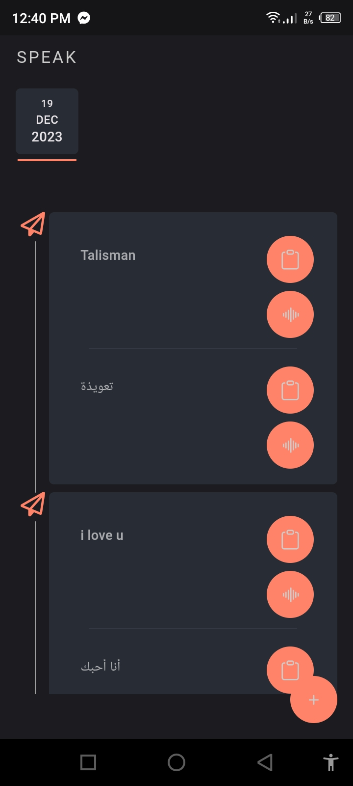
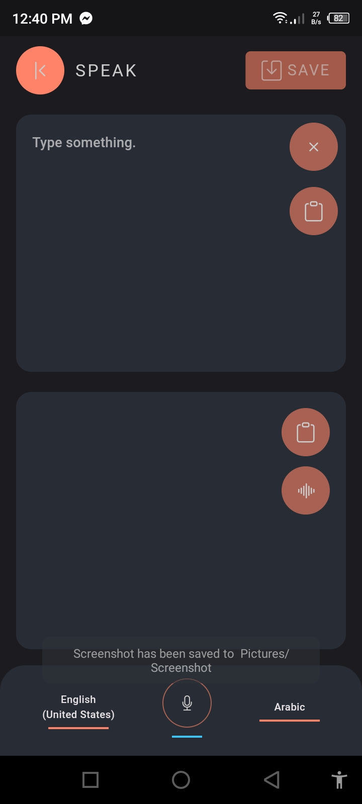
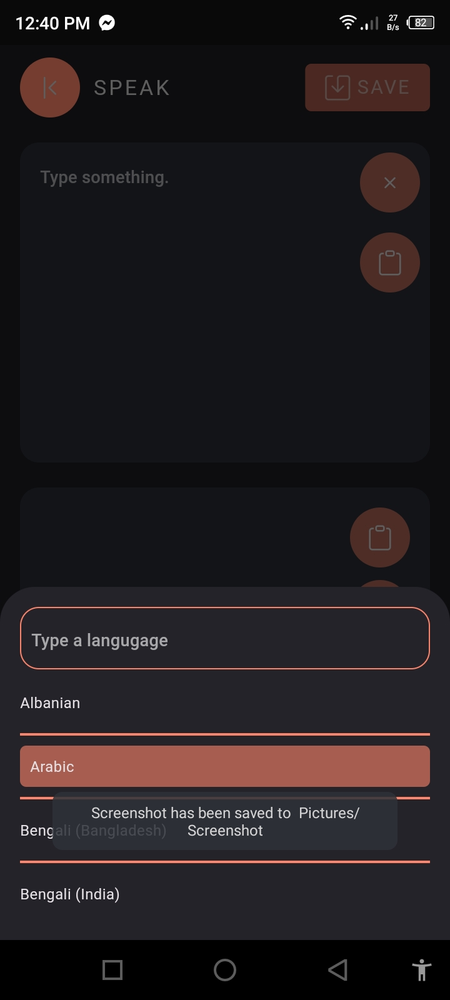

## LinguaTranslate
LinguaTranslate is an innovative translation app built with Flutter and powered by Hive, offering seamless and efficient translation services right at your fingertips. This user-friendly mobile application integrates cutting-edge speech-to-text and text-to-speech functionalities, providing an intuitive platform for instant translations in multiple languages.

## Key Features
Effortless Translation: Translate text instantly between various languages, enabling smooth communication across borders and cultures.
Speech Recognition: Speak into the app and watch your words transform into written text for quick and accurate translations.
Text-to-Speech: Hear translated text spoken aloud in the chosen language, enhancing comprehension and pronunciation.
Hive Integration: Utilizes Hive's efficient local database for storing translations, allowing easy access and quick retrieval of previously translated content.
Customizable Experience: Tailor the app's interface with themes and preferences that suit your style, ensuring a personalized translation experience.
Multi-Language Support: Access a wide array of languages and dialects for both input and output, breaking language barriers effortlessly.
Offline Functionality: Enjoy uninterrupted translation services even without an internet connection, ensuring accessibility anytime, anywhere.
LinguaTranslate empowers users with a seamless, on-the-go translation experience. Whether you're traveling, studying, or engaging with international communities, this app simplifies language barriers and fosters meaningful connections.

## Installation
Experience the convenience of LinguaTranslate by downloading the app from the Google Play Store or Apple App Store. Explore its powerful translation features and embark on a journey of seamless communication across languages.

  
  
  

